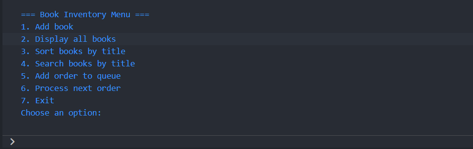
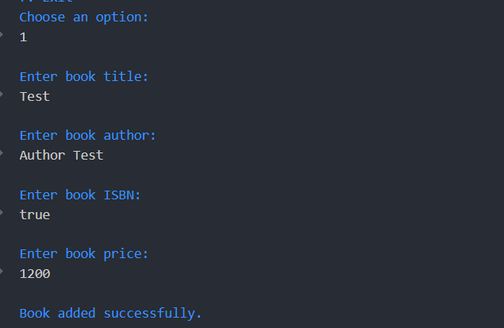
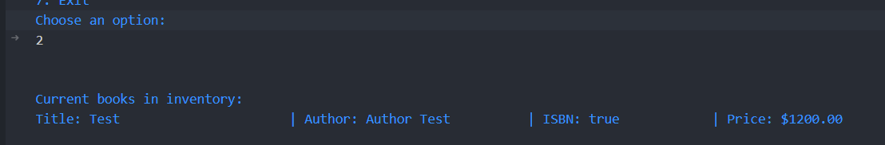
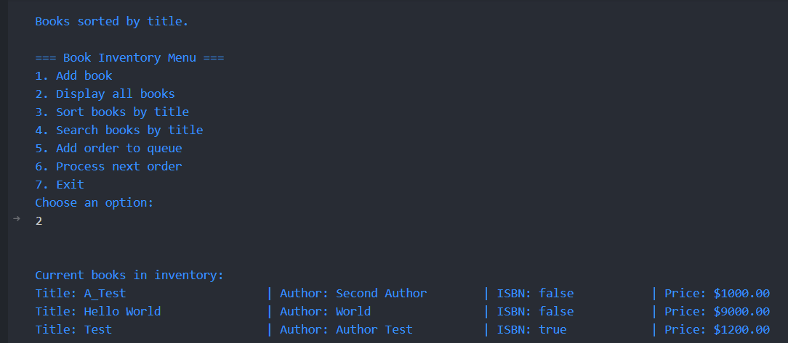
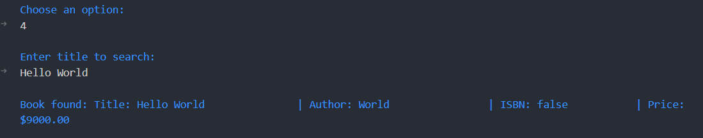
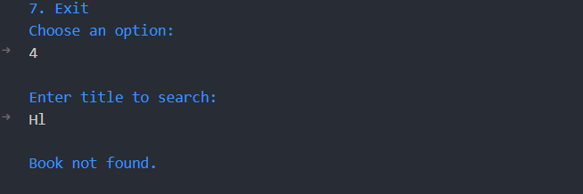
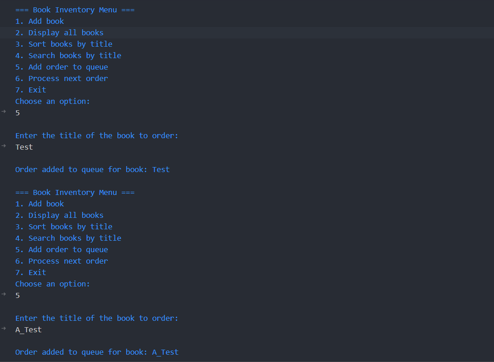

# Bookstore Inventory Management System - DSA Final Project

## Author: Lovely Joy Gutierrez

This project is a simple, console-based Bookstore Inventory Management System created for the Data Structures and Algorithms lab. It is written in Java and demonstrates the practical application of fundamental data structures and algorithms, including linked lists, queues, sorting, and searching.

## Features

The application is menu-driven and currently supports the following features:

1. **Add book**  
   - Collects book details (title, author, ISBN, price) from the user and stores them in an in-memory inventory using a `LinkedList<Book>`.

2. **Display all books**  
   - Iterates through the inventory and displays a formatted list of all books.

3. **Sort books by title**  
   - Uses a manually implemented **bubble sort** algorithm to sort the books alphabetically by title (case-insensitive).

4. **Search books by title**  
   - Performs a **linear search** (case-insensitive) over the inventory to find a book by its exact title and displays the result.

5. **Add order to queue**  
   - Adds a customer order (by book title) to a `LinkedList<String>` that is used as a **queue** (FIFO) to store pending orders.

6. **Process next order**  
   - Removes the next book title from the front of the order queue and displays a message indicating that the order has been processed. If the queue is empty, an appropriate message is shown.

7. **Exit**  
   - Closes the application.

## How to Run the Project

### Prerequisites

- Java Development Kit (JDK) installed (Java 8 or later).  
- A terminal or command prompt.

### Steps

1. **Clone or download the project**

   If using Git:

   ```bash
   git clone <your-repository-url>
   cd BookStore
   ```

   Or, if you downloaded a ZIP, extract it and navigate into the project folder.

2. **Navigate to the `src` directory**

   ```bash
   cd src
   ```

3. **Compile the Java files**

   ```bash
   javac Book.java Inventory.java
   ```

4. **Run the application**

   ```bash
   java Inventory
   ```

   You should now see the main menu in your console.

## Sample Screenshots

(Add your screenshots in this section after running the application. You can place the image files in a `screenshots/` folder and reference them in Markdown.)

### 1. Main Menu

_Example: Display of the main menu when the program starts._



### 2. Adding New Books

_Example: User entering book details and confirmation message._



### 3. Displaying All Books

_Example: List of all books currently in the inventory._



### 4. Sorting Books by Title

_Example: Sorting operation and confirmation message, followed by the sorted list._



### 5. Searching for a Book (Found)

_Example: Searching for an existing book title and showing the result._



### 6. Searching for a Book (Not Found)

_Example: Searching for a title that does not exist in the inventory._



### 7. Order Queue: Adding Orders

_Example: Adding orders to the queue_



---

### 8. Processing Orders
_Example: Processing the added books_
``
